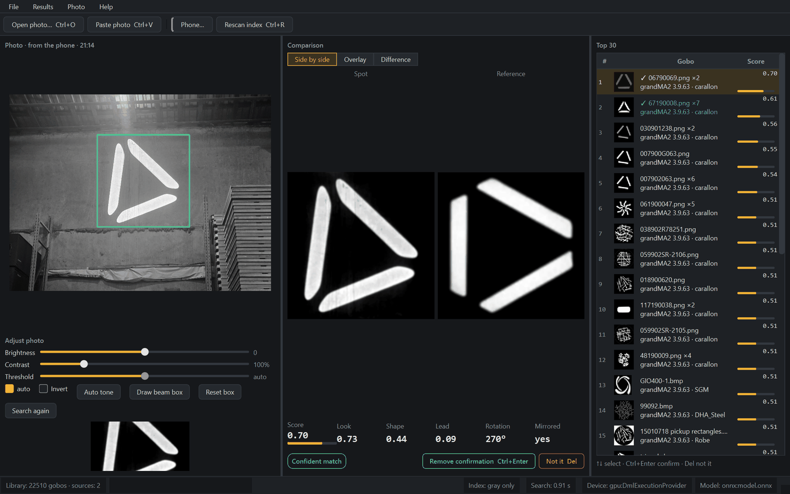
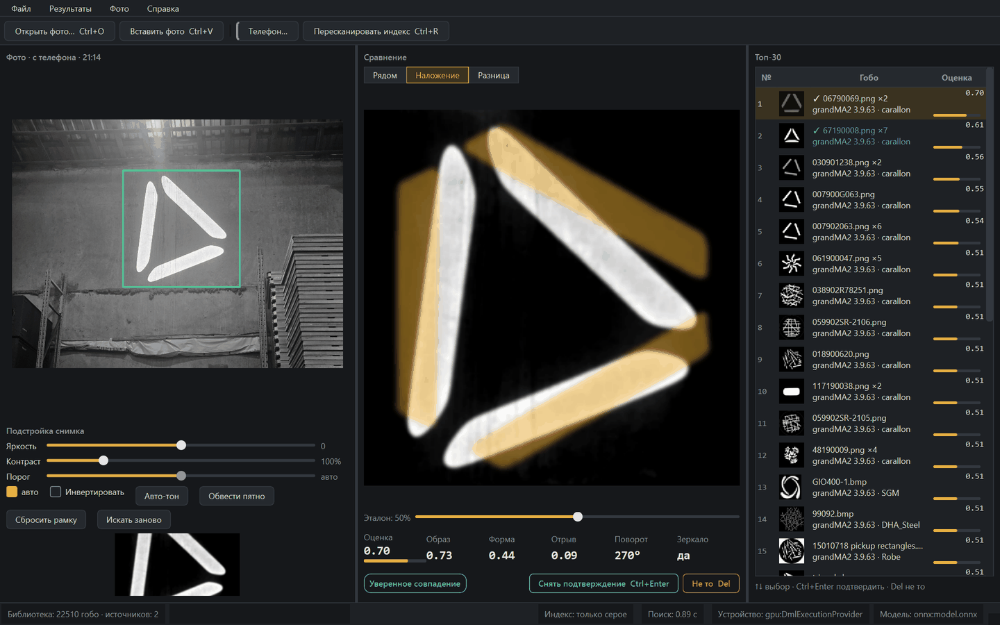
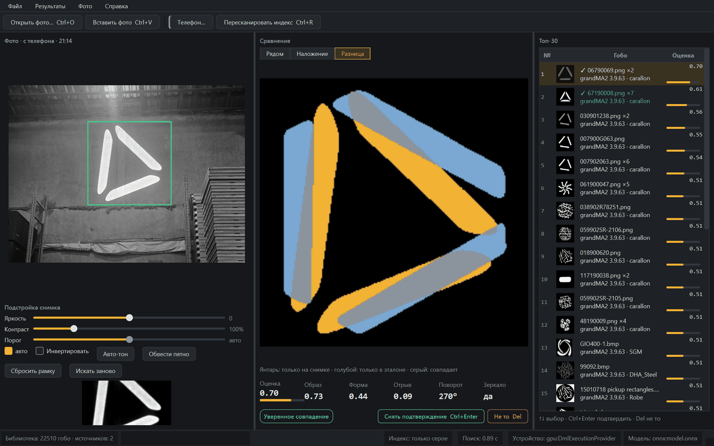
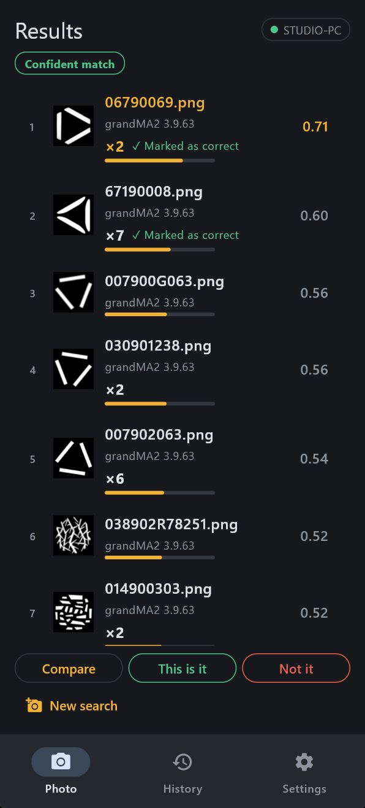
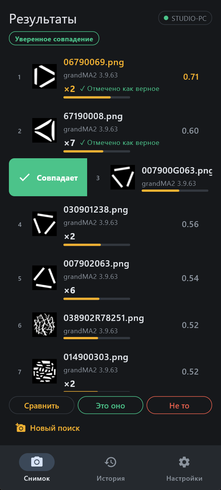
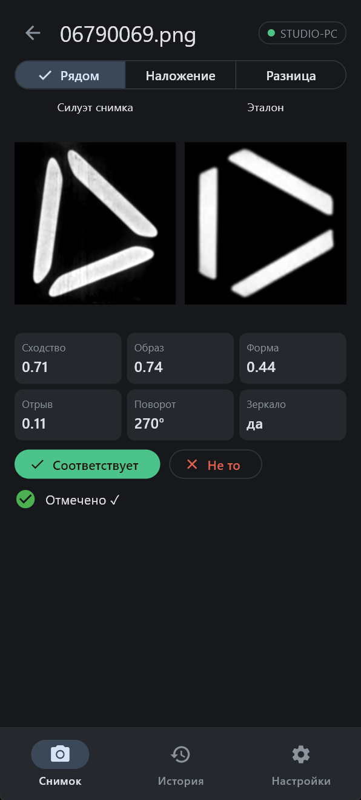
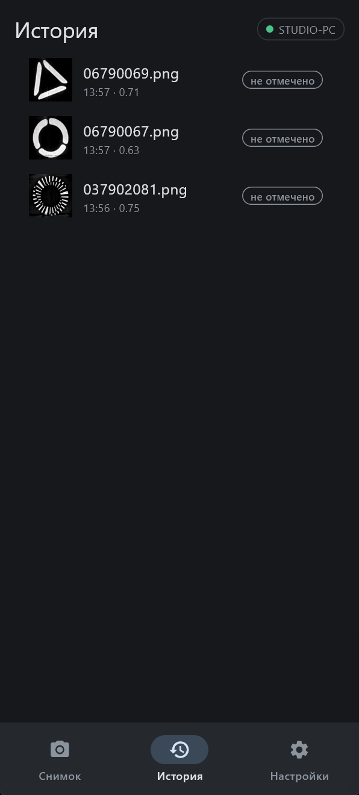
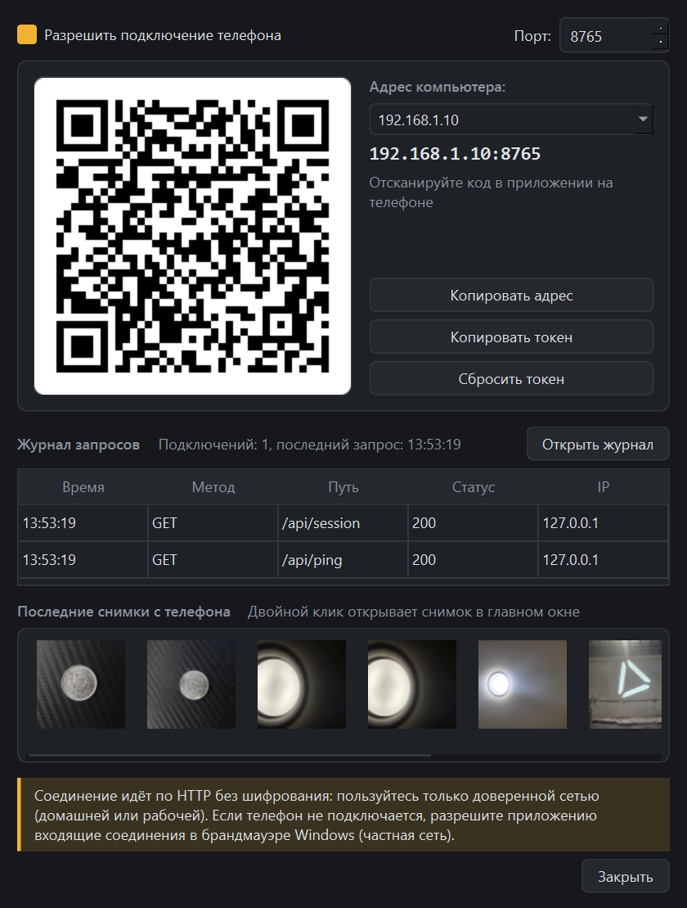
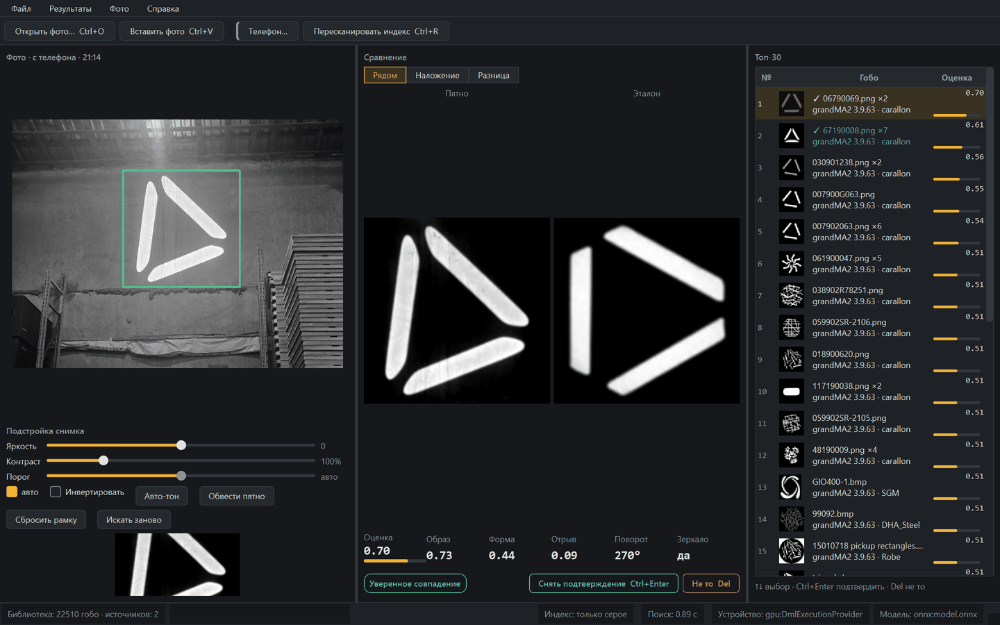
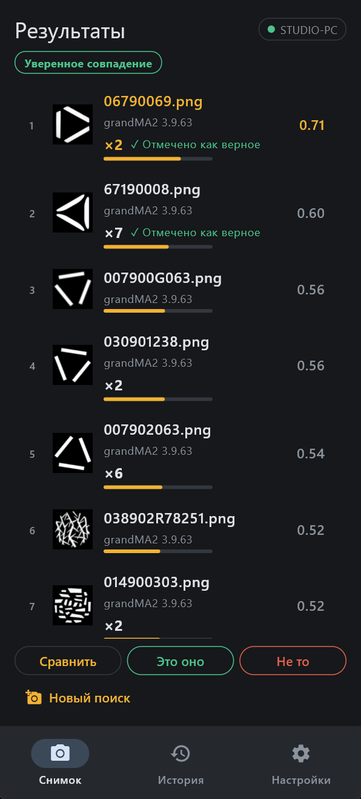

# Gobo Finder

**English** · [Русский](#gobo-finder---русский)

Gobo Finder identifies a gobo from a photo by searching the gobo libraries of lighting consoles. It runs on Windows and macOS; the Android app sends photos to the computer and shows the results on the phone.

This repository contains release builds only. The source code is not published.

## Contents

1. [Screenshots](#screenshots)
2. [Download](#download)
3. [Installation](#installation)
4. [Phone app](#phone-app)
5. [Updates and privacy](#updates-and-privacy)
6. [Support](#support)
7. [Author](#author)
8. [License](#license)

## Screenshots

<b>More screenshots</b>

 

| Overlay | Difference |
|---|---|
|  |  |

| Results | Swipe to mark | Comparison | History |
|---|---|---|---|
|  |  |  |  |

| Phone window on the computer |
|---|
|  |

## Download

All files are attached to each release: **[Latest release](https://github.com/spacesarmat/gobo-finder-releases/releases/latest)**.

| Platform | File |
|---|---|
| Windows, x64 | `GoboFinder-<version>-windows-x64.zip` |
| macOS, Apple Silicon (M1 and later) | `GoboFinder-<version>-macos-arm64.zip` |
| macOS, Intel | `GoboFinder-<version>-macos-x64.zip` |
| Android | `GoboFinder-<version>-android.apk` |

Releases marked *Pre-release* are test builds.

## Installation

### Windows

1. Extract the archive to any folder.
2. Run `GoboFinder\GoboFinder.exe`.
3. The build is not signed. If Windows SmartScreen shows a warning, select **More info → Run anyway**.

### macOS

1. Extract the archive and move `GoboFinder.app` to **Applications**.
2. The build is not signed with an Apple Developer ID. On first launch, right-click the app and select **Open**, then confirm **Open**.
3. On macOS 15 and later: try to open the app once, then go to **System Settings → Privacy & Security** and select **Open Anyway**.

### Android

1. Download the `.apk` file on the phone.
2. Open it and allow installation from this source when Android asks.
3. A newer version installs over the previous one; settings and history are kept.

### First start

On first start, point the program to the folder with the gobo images of your lighting console and build the index (**Ctrl+R**, on macOS **⌘R**). After updating from version 0.3.0, rebuild the index once.

## Phone app

1. On the computer, open **Phone** and switch the server on. It is off by default.
2. In the phone app, scan the QR code or enter the address and token manually.
3. Take a photo of the gobo and select **Find**.

The phone and the computer must be on the same Wi-Fi network and run the same version. The connection uses plain HTTP protected by a token: switch the server on only in a trusted network.

## Updates and privacy

- The program and the phone app check this repository for a newer version at most once a day.
- The check sends one request to GitHub with the program version in the User-Agent header. No other data is sent.
- Automatic checking can be switched off in **Settings**; **Help → Check for updates** checks on request.
- Test builds are offered only when **Offer beta versions** is switched on.

## Support

Report problems in [Issues](https://github.com/spacesarmat/gobo-finder-releases/issues). Include the program version (**Help → About**), the operating system and the steps that lead to the problem.

## Author

| | |
|---|---|
| Author | Andy Bum - [Telegram @Andy_bum](https://t.me/Andy_bum) |
| Support the project | [Boosty](https://boosty.to/djmaker/purchase/4106293) |

## License

Gobo Finder is distributed under the [MIT License](LICENSE). Copyright (c) 2026 Andy Bum.
Third-party components included in the builds keep their own licenses.

---

# Gobo Finder - Русский

[English](#gobo-finder) · **Русский**

Gobo Finder определяет гобо по фотографии, выполняя поиск по библиотекам гобо световых пультов. Программа работает в Windows и macOS; приложение для Android отправляет снимки на компьютер и показывает результаты на телефоне.

В этом репозитории опубликованы только сборки выпусков. Исходный код не публикуется.

## Содержание

1. [Скриншоты](#скриншоты)
2. [Загрузка](#загрузка)
3. [Установка](#установка)
4. [Приложение для телефона](#приложение-для-телефона)
5. [Обновления и конфиденциальность](#обновления-и-конфиденциальность)
6. [Поддержка](#поддержка)
7. [Автор](#автор)
8. [Лицензия](#лицензия)

## Скриншоты

<b>Ещё скриншоты</b>

 

| Наложение | Разница |
|---|---|
|  |  |

| Результаты | Отметка свайпом | Сравнение | История |
|---|---|---|---|
|  |  |  |  |

| Окно «Телефон» на компьютере |
|---|
|  |

## Загрузка

Все файлы приложены к каждому выпуску: **[Последний выпуск](https://github.com/spacesarmat/gobo-finder-releases/releases/latest)**.

| Система | Файл |
|---|---|
| Windows, x64 | `GoboFinder-<версия>-windows-x64.zip` |
| macOS, Apple Silicon (M1 и новее) | `GoboFinder-<версия>-macos-arm64.zip` |
| macOS, Intel | `GoboFinder-<версия>-macos-x64.zip` |
| Android | `GoboFinder-<версия>-android.apk` |

Выпуски с пометкой *Pre-release* - тестовые сборки.

## Установка

### Windows

1. Распакуйте архив в любую папку.
2. Запустите `GoboFinder\GoboFinder.exe`.
3. Сборка не подписана. Если Windows SmartScreen показывает предупреждение, выберите **Подробнее → Выполнить в любом случае**.

### macOS

1. Распакуйте архив и перенесите `GoboFinder.app` в папку **Программы**.
2. Сборка не подписана Apple Developer ID. При первом запуске щёлкните программу правой кнопкой, выберите **Открыть** и подтвердите **Открыть**.
3. В macOS 15 и новее: попробуйте открыть программу один раз, затем откройте **Системные настройки → Конфиденциальность и безопасность** и выберите **Всё равно открыть**.

### Android

1. Скачайте файл `.apk` на телефон.
2. Откройте его и разрешите установку из этого источника, когда Android запросит.
3. Новая версия устанавливается поверх предыдущей; настройки и история сохраняются.

### Первый запуск

При первом запуске укажите папку с изображениями гобо вашего светового пульта и постройте индекс (**Ctrl+R**, в macOS **⌘R**). После обновления с версии 0.3.0 один раз перестройте индекс.

## Приложение для телефона

1. На компьютере откройте окно **Телефон** и включите сервер. По умолчанию он выключен.
2. В приложении на телефоне отсканируйте QR-код или введите адрес и токен вручную.
3. Сфотографируйте гобо и нажмите **Найти**.

Телефон и компьютер должны быть в одной сети Wi-Fi и иметь одну версию. Соединение идёт по HTTP и защищено токеном: включайте сервер только в доверенной сети.

## Обновления и конфиденциальность

- Программа и приложение для телефона проверяют этот репозиторий на наличие новой версии не чаще раза в сутки.
- Проверка отправляет один запрос к GitHub с номером версии программы в заголовке User-Agent. Другие данные не передаются.
- Автоматическую проверку можно отключить в **Настройках**; **Справка → Проверить обновления** проверяет по запросу.
- Тестовые сборки предлагаются только при включённом параметре **Предлагать бета-версии**.

## Поддержка

Сообщайте о проблемах в [Issues](https://github.com/spacesarmat/gobo-finder-releases/issues). Укажите версию программы (**Справка → О программе**), операционную систему и шаги, которые приводят к проблеме.

## Автор

| | |
|---|---|
| Автор | Andy Bum - [Telegram @Andy_bum](https://t.me/Andy_bum) |
| Поддержать проект | [Boosty](https://boosty.to/djmaker/purchase/4106293) |

## Лицензия

Gobo Finder распространяется по [лицензии MIT](LICENSE). Copyright (c) 2026 Andy Bum.
Сторонние компоненты, входящие в сборки, распространяются по своим лицензиям.
